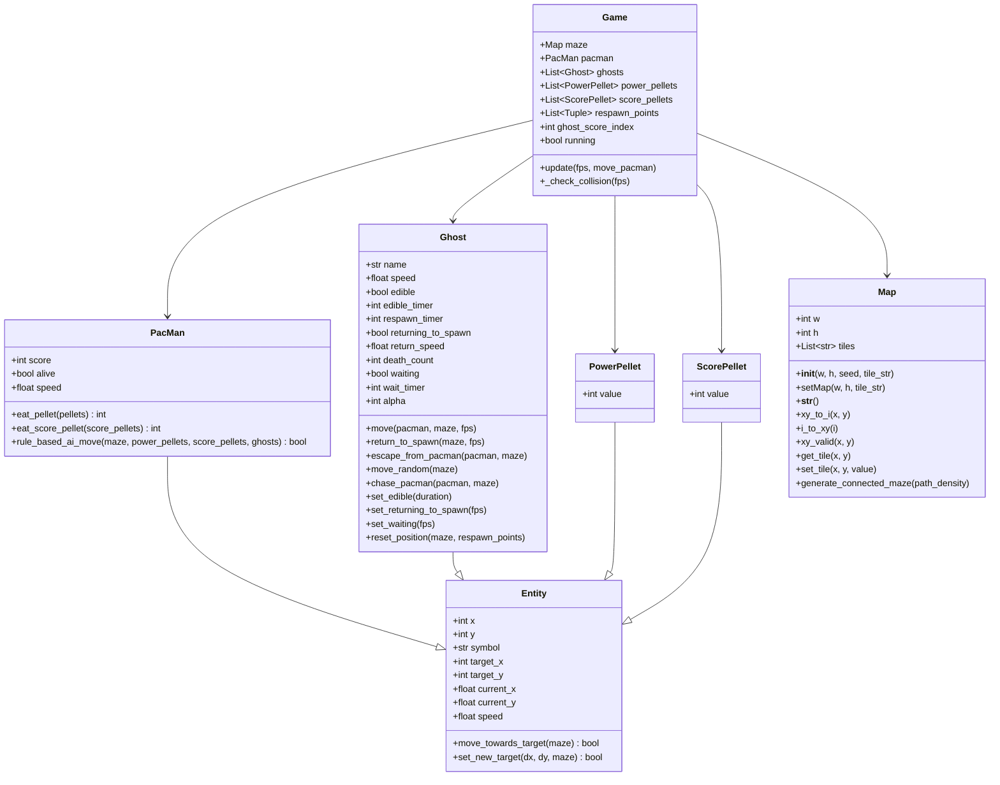

```mermaid
classDiagram
    class Entity {
        +int x
        +int y
        +str symbol
        +int target_x
        +int target_y
        +float current_x
        +float current_y
        +float speed
        +move_towards_target(maze) bool
        +set_new_target(dx, dy, maze) bool
    }

    class PacMan {
        +int score
        +bool alive
        +float speed
        +eat_pellet(pellets) int
        +eat_score_pellet(score_pellets) int
        +rule_based_ai_move(maze, power_pellets, score_pellets, ghosts) bool
    }
    PacMan --|> Entity

    class Ghost {
        +str name
        +float speed
        +bool edible
        +int edible_timer
        +int respawn_timer
        +bool returning_to_spawn
        +float return_speed
        +int death_count
        +bool waiting
        +int wait_timer
        +int alpha
        +move(pacman, maze, fps)
        +return_to_spawn(maze, fps)
        +escape_from_pacman(pacman, maze)
        +move_random(maze)
        +chase_pacman(pacman, maze)
        +set_edible(duration)
        +set_returning_to_spawn(fps)
        +set_waiting(fps)
        +reset_position(maze, respawn_points)
    }
    Ghost --|> Entity

    class PowerPellet {
        +int value
    }
    PowerPellet --|> Entity

    class ScorePellet {
        +int value
    }
    ScorePellet --|> Entity

    class Map {
        +int w
        +int h
        +List~str~ tiles
        +__init__(w, h, seed, tile_str)
        +setMap(w, h, tile_str)
        +__str__()
        +xy_to_i(x, y)
        +i_to_xy(i)
        +xy_valid(x, y)
        +get_tile(x, y)
        +set_tile(x, y, value)
        +generate_connected_maze(path_density)
    }

    class Game {
        +Map maze
        +PacMan pacman
        +List~Ghost~ ghosts
        +List~PowerPellet~ power_pellets
        +List~ScorePellet~ score_pellets
        +List~Tuple~ respawn_points
        +int ghost_score_index
        +bool running
        +update(fps, move_pacman)
        +_check_collision(fps)
    }

    Game --> Map
    Game --> PacMan
    Game --> Ghost
    Game --> PowerPellet
    Game --> ScorePellet
```
