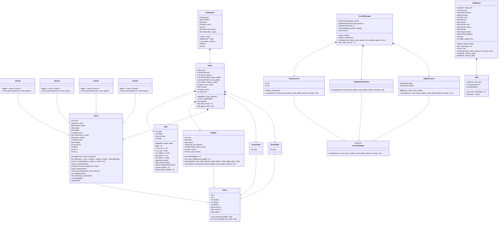

```mermaid
classDiagram

    %% Game Module Classes (game/)
    class Entity {
        +int x
        +int y
        +str symbol
        +int target_x
        +int target_y
        +float current_x
        +float current_y
        +float speed
        +move_towards_target() bool
        +set_new_target(dx, dy, maze) bool
    }

    class PacMan {
        +int score
        +bool alive
        +float speed
        +Tuple~int~ last_direction
        +int alternating_vertical_count
        +int stuck_count
        +int max_stuck_frames
        +eat_pellet(pellets) int
        +eat_score_pellet(score_pellets) int
        +find_path(start, goal, maze, ghosts, power_pellets, mode, target_type) Tuple
        +rule_based_ai_move(maze, power_pellets, score_pellets, ghosts) bool
    }
    PacMan --|> Entity

    class Ghost {
        +str name
        +Tuple~int~ color
        +float default_speed
        +float speed
        +bool edible
        +int edible_timer
        +bool returning_to_spawn
        +float return_speed
        +int death_count
        +bool waiting
        +int wait_timer
        +int alpha
        +int last_x
        +int last_y
        +move(pacman, maze, fps, ghosts)
        +bfs_path(start_x, start_y, target_x, target_y, maze) Optional[Tuple]
        +move_to_target(target_x, target_y, maze) bool
        +return_to_spawn(maze)
        +escape_from_pacman(pacman, maze)
        +move_random(maze)
        +chase_pacman(pacman, maze, ghosts)
        +set_edible(duration)
        +set_returning_to_spawn(fps)
        +set_waiting(fps)
        +reset(maze)
    }
    Ghost --|> Entity

    class Ghost1 {
        +__init__(x, y, name="Ghost1")
        +chase_pacman(pacman, maze, ghosts)
    }
    Ghost1 --|> Ghost

    class Ghost2 {
        +__init__(x, y, name="Ghost2")
        +chase_pacman(pacman, maze, ghosts)
    }
    Ghost2 --|> Ghost

    class Ghost3 {
        +__init__(x, y, name="Ghost3")
        +chase_pacman(pacman, maze, ghosts)
    }
    Ghost3 --|> Ghost

    class Ghost4 {
        +__init__(x, y, name="Ghost4")
        +chase_pacman(pacman, maze, ghosts)
    }
    Ghost4 --|> Ghost

    class PowerPellet {
        +int value
    }
    PowerPellet --|> Entity

    class ScorePellet {
        +int value
    }
    ScorePellet --|> Entity

    class Map {
        +int width
        +int height
        +List~str~ tiles
        +int seed
        +__init__(width, height, seed)
        +__str__() str
        +xy_to_i(x, y) int
        +i_to_xy(i) Tuple
        +xy_valid(x, y) bool
        +get_tile(x, y) str
        +set_tile(x, y, value)
        +generate_maze()
        +add_central_room()
        +extend_walls(extend_prob)
        +narrow_paths() int
        +place_power_pellets() int
    }

    class Game {
        +Map maze
        +PacMan pacman
        +List~Ghost~ ghosts
        +List~PowerPellet~ power_pellets
        +List~ScorePellet~ score_pellets
        +List~Tuple~ respawn_points
        +int ghost_score_index
        +bool running
        +str player_name
        +int start_time
        +update(fps, move_pacman)
        +_check_collision(fps)
        +end_game()
        +get_final_score() int
        +did_player_win() bool
    }
    Game *--> Map
    Game *--> PacMan
    Game *--> Ghost
    Game *--> PowerPellet
    Game *--> ScorePellet

    class ControlStrategy {
        <<abstract>>
        +move(pacman, maze, power_pellets, score_pellets, ghosts, moving) bool
    }

    class PlayerControl {
        +int dx
        +int dy
        +handle_event(event)
        +move(pacman, maze, power_pellets, score_pellets, ghosts, moving) bool
    }
    PlayerControl --|> ControlStrategy

    class RuleBasedAIControl {
        +move(pacman, maze, power_pellets, score_pellets, ghosts, moving) bool
    }
    RuleBasedAIControl --|> ControlStrategy

    class DQNAIControl {
        +DQNAgent agent
        +torch.device device
        +__init__(maze_width, maze_height)
        +move(pacman, maze, power_pellets, score_pellets, ghosts, moving) bool
    }
    DQNAIControl --|> ControlStrategy

    class ControlManager {
        +PlayerControl player_control
        +RuleBasedAIControl rule_based_ai
        +DQNAIControl dqn_ai
        +ControlStrategy current_strategy
        +bool moving
        +switch_mode()
        +handle_event(event)
        +move(pacman, maze, power_pellets, score_pellets, ghosts) bool
        +get_mode_name() str
    }
    ControlManager *--> PlayerControl
    ControlManager *--> RuleBasedAIControl
    ControlManager *--> DQNAIControl

    %% AI Module Classes (ai/)
    class PacManEnv {
        +Game game
        +bool visualize
        +bool done
        +int frame_count
        +int lives
        +Discrete action_space
        +Box observation_space
        +reset() Tuple
        +step(action) Tuple
        +_get_state() ndarray
        +render()
        +close()
    }
    PacManEnv *--> Game

    class DQN {
        +Tuple~int~ input_dim
        +nn.Sequential conv
        +nn.Sequential fc
        +_get_conv_out(shape) int
        +forward(x) Tensor
    }

    class DQNAgent {
        +Tuple~int~ state_dim
        +int action_dim
        +torch.device device
        +deque memory
        +int batch_size
        +float gamma
        +float epsilon
        +float epsilon_min
        +float epsilon_decay
        +DQN model
        +DQN target_model
        +optim.Adam optimizer
        +int steps
        +int target_update_freq
        +update_target_model()
        +get_action(state) int
        +train() float
        +remember(state, action, reward, next_state, done)
        +save(path, memory_path)
        +load(path, memory_path)
    }
    DQNAgent *--> DQN
```