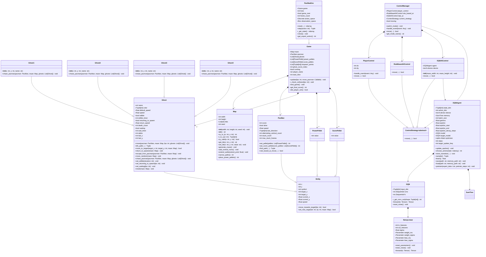

```mermaid
classDiagram
    %% Game Module Classes (game/)
    class Entity {
        +int x
        +int y
        +str symbol
        +int target_x
        +int target_y
        +float current_x
        +float current_y
        +float speed
        +move_towards_target(fps: int) bool
        +set_new_target(dx: int, dy: int, maze: Map) bool
    }

    class PacMan {
        +int score
        +bool alive
        +float speed
        +Tuple[int] last_direction
        +int alternating_vertical_count
        +int stuck_count
        +int max_stuck_frames
        +eat_pellet(pellets: List[PowerPellet]) int
        +eat_score_pellet(score_pellets: List[ScorePellet]) int
        +find_path(...) Tuple
        +rule_based_ai_move(...) bool
    }
    PacMan --|> Entity

    class Ghost {
        +str name
        +Tuple[int] color
        +float default_speed
        +float speed
        +bool edible
        +int edible_timer
        +bool returning_to_spawn
        +float return_speed
        +int death_count
        +bool waiting
        +int wait_timer
        +int alpha
        +int last_x
        +int last_y
        +move(pacman: PacMan, maze: Map, fps: int, ghosts: List[Ghost]) void
        +bfs_path(...) Tuple
        +move_to_target(target_x: int, target_y: int, maze: Map) bool
        +return_to_spawn(maze: Map) void
        +escape_from_pacman(pacman: PacMan, maze: Map) void
        +move_random(maze: Map) void
        +chase_pacman(pacman: PacMan, maze: Map, ghosts: List[Ghost]) void
        +set_edible(duration: int) void
        +set_returning_to_spawn(fps: int) void
        +set_waiting(fps: int) void
        +reset(maze: Map) void
    }
    Ghost --|> Entity

    class Ghost1 {
        +__init__(x: int, y: int, name: str)
        +chase_pacman(pacman: PacMan, maze: Map, ghosts: List[Ghost]) void
    }
    Ghost1 --|> Ghost

    class Ghost2 {
        +__init__(x: int, y: int, name: str)
        +chase_pacman(pacman: PacMan, maze: Map, ghosts: List[Ghost]) void
    }
    Ghost2 --|> Ghost

    class Ghost3 {
        +__init__(x: int, y: int, name: str)
        +chase_pacman(pacman: PacMan, maze: Map, ghosts: List[Ghost]) void
    }
    Ghost3 --|> Ghost

    class Ghost4 {
        +__init__(x: int, y: int, name: str)
        +chase_pacman(pacman: PacMan, maze: Map, ghosts: List[Ghost]) void
    }
    Ghost4 --|> Ghost

    class PowerPellet {
        +int value
    }
    PowerPellet --|> Entity

    class ScorePellet {
        +int value
    }
    ScorePellet --|> Entity

    class Map {
        +int width
        +int height
        +List[str] tiles
        +int seed
        +__init__(width: int, height: int, seed: int) void
        +__str__() str
        +xy_to_i(x: int, y: int) int
        +i_to_xy(i: int) Tuple[int]
        +xy_valid(x: int, y: int) bool
        +get_tile(x: int, y: int) str
        +set_tile(x: int, y: int, value: str) void
        +generate_maze() void
        +add_central_room() void
        +extend_walls(extend_prob: float) void
        +narrow_paths() int
        +place_power_pellets() int
    }

    class Game {
        +Map maze
        +PacMan pacman
        +List[Ghost] ghosts
        +List[PowerPellet] power_pellets
        +List[ScorePellet] score_pellets
        +List[Tuple[int]] respawn_points
        +int ghost_score_index
        +bool running
        +str player_name
        +int start_time
        +update(fps: int, move_pacman: Callable) void
        +_check_collision(fps: int) void
        +end_game() void
        +get_final_score() int
        +did_player_win() bool
    }
    Game *--> "1" Map
    Game *--> "1" PacMan
    Game *--> "0..*" Ghost
    Game *--> "0..*" PowerPellet
    Game *--> "0..*" ScorePellet

    class ControlStrategy~abstract~ {
        +move(...) bool
    }

    class PlayerControl {
        +int dx
        +int dy
        +handle_event(event: Any) void
        +move(...) bool
    }
    PlayerControl --|> ControlStrategy

    class RuleBasedAIControl {
        +move(...) bool
    }
    RuleBasedAIControl --|> ControlStrategy

    class DQNAIControl {
        +DQNAgent agent
        +torch.device device
        +__init__(maze_width: int, maze_height: int) void
        +move(...) bool
    }
    DQNAIControl --|> ControlStrategy
    DQNAIControl --> DQNAgent

    class ControlManager {
        +PlayerControl player_control
        +RuleBasedAIControl rule_based_ai
        +DQNAIControl dqn_ai
        +ControlStrategy current_strategy
        +bool moving
        +switch_mode() void
        +handle_event(event: Any) void
        +move(...) bool
        +get_mode_name() str
    }
    ControlManager *--> "1" PlayerControl
    ControlManager *--> "1" RuleBasedAIControl
    ControlManager *--> "1" DQNAIControl
    ControlManager --> ControlStrategy

    %% AI Module Classes (ai/)
    class PacManEnv {
        +Game game
        +int lives
        +bool game_over
        +int frame_count
        +Discrete action_space
        +Box observation_space
        +reset(...) ndarray
        +step(action: int) Tuple
        +_get_state() ndarray
        +close() void
        +get_expert_action() int
    }
    PacManEnv --|> Game

    class NoisyLinear {
        +int in_features
        +int out_features
        +float sigma
        +Parameter weight_mu
        +Parameter weight_sigma
        +Parameter bias_mu
        +Parameter bias_sigma
        +reset_parameters() void
        +reset_noise() void
        +forward(x: Tensor) Tensor
    }

    class DQN {
        +Tuple[int] input_dim
        +nn.Sequential conv
        +nn.Sequential fc
        +_get_conv_out(shape: Tuple[int]) int
        +forward(x: Tensor) Tensor
        +reset_noise() void
    }
    DQN *--> NoisyLinear

    class DQNAgent {
        +Tuple[int] state_dim
        +int action_dim
        +torch.device device
        +SumTree memory
        +int batch_size
        +float gamma
        +float epsilon
        +float epsilon_start
        +float epsilon_end
        +float epsilon_decay_steps
        +DQN model
        +DQN target_model
        +optim.Adam optimizer
        +int steps
        +int target_update_freq
        +update_epsilon() void
        +choose_action(state: ndarray) int
        +store_transition(...) void
        +sample() Tuple
        +learn() float
        +save(path: str, memory_path: str) void
        +load(path: str, memory_path: str) void
        +pretrain(expert_data: List, pretrain_steps: int) void
    }
    DQNAgent *--> DQN
    DQNAgent *--> SumTree
```