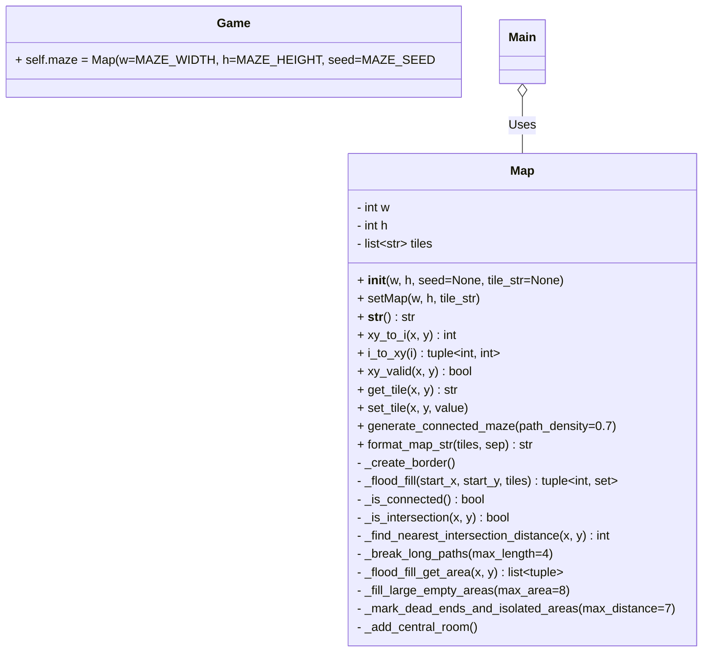

```mermaid
classDiagram
    class Map {
        - int w
        - int h
        - list~str~ tiles
        + __init__(w, h, seed=None, tile_str=None)
        + setMap(w, h, tile_str)
        + __str__() str
        + xy_to_i(x, y) int
        + i_to_xy(i) tuple~int, int~
        + xy_valid(x, y) bool
        + get_tile(x, y) str
        + set_tile(x, y, value)
        + generate_connected_maze(path_density=0.7)
        + format_map_str(tiles, sep) str
    }

    %% Private methods
    class Map {
        - _create_border()
        - _flood_fill(start_x, start_y, tiles) tuple~int, set~
        - _is_connected() bool
        - _is_intersection(x, y) bool
        - _find_nearest_intersection_distance(x, y) int
        - _break_long_paths(max_length=4)
        - _flood_fill_get_area(x, y) list~tuple~
        - _fill_large_empty_areas(max_area=8)
        - _mark_dead_ends_and_isolated_areas(max_distance=7)
        - _add_central_room()
    }

    class Game {
        + self.maze = Map(w=MAZE_WIDTH, h=MAZE_HEIGHT, seed=MAZE_SEED
    }

    Main o-- Map : Uses
```
